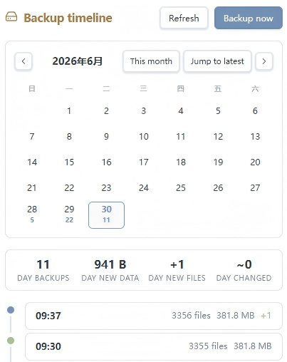
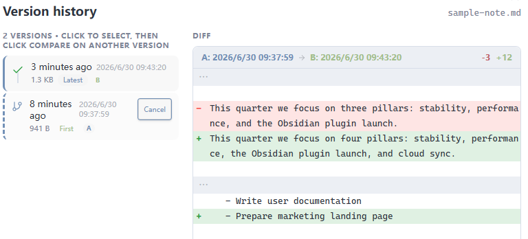
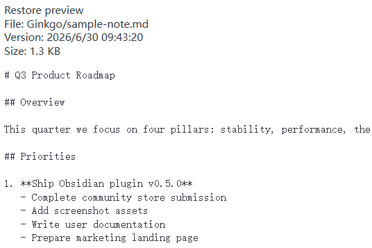
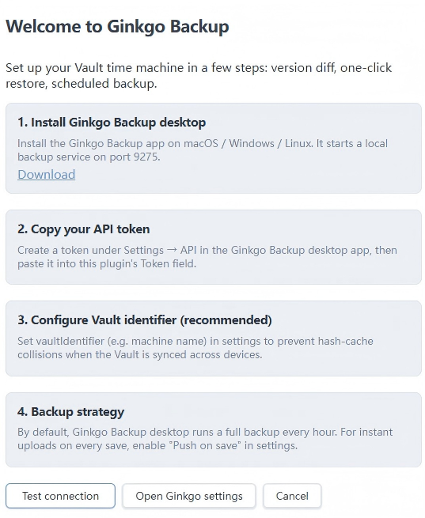
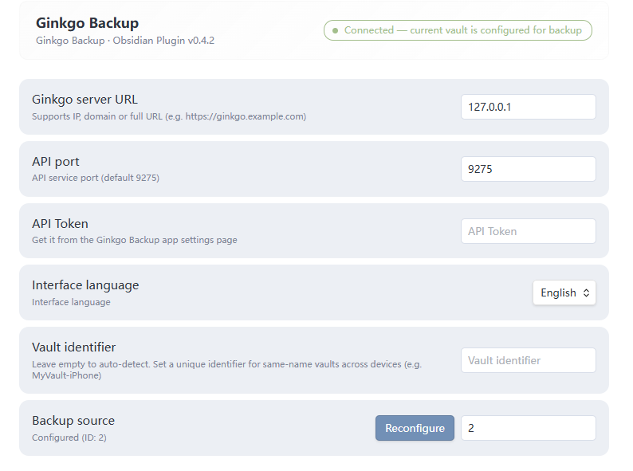
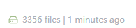

# Ginkgo Backup for Obsidian

> 你的 Obsidian 知识库的时光机 — 自动备份、版本对比、一键恢复。
>
> A time machine for your Obsidian vault — instant push, version diff, and one-click restore, powered by the [Ginkgo Backup](https://ginkgobackup.com) desktop engine.

[](./manifest.json)
[](./LICENSE)
[](https://obsidian.md)
[](./manifest.json)

---

## Screenshots

| Timeline (calendar view) | File history & diff |
|:---:|:---:|
|  |  |

| Restore preview | Setup guide |
|:---:|:---:|
|  |  |

| Settings | Status bar menu |
|:---:|:---:|
|  |  |

## Overview

**Ginkgo Backup for Obsidian** bridges your vault to the [Ginkgo Backup](https://ginkgobackup.com) desktop application, turning the local backup engine into a first-class Obsidian citizen. Every note you save is captured into a versioned timeline; any previous state can be diffed and restored in a single click — without leaving Obsidian.

The plugin is desktop-only (it talks to the local Ginkgo Backup service on port `9275`) and ships with bilingual UI (English / 简体中文).

## How It Works

The plugin runs a **two-track backup model**, so you never have to choose between immediacy and completeness:

| Track | Trigger | What it captures | Latency |
|-------|---------|-------------------|---------|
| **Instant Push** (recommended) | File save | Text notes you edit (`md`, `canvas`, `base`, `json`, `css`) | ~seconds, debounced |
| **Full Backup** | Manual or scheduled | The entire vault, including binary attachments | Minutes, background |

1. On save, the **Staging Manager** computes a SHA-256 hash of the file content and pushes it to the Ginkgo Backup staging area — but only if the content actually changed. Identical saves are de-duplicated.
2. The **Connection Manager** keeps a heartbeat to the local server, auto-recovers from disconnects, and flushes any pending pushes the moment the link comes back.
3. The actual snapshot is written by Ginkgo Backup in the background, so your writing flow is never blocked.

## Features

- **Instant Push on Save** — Text notes are pushed to staging the moment you save, with SHA-256 content de-duplication.
- **Scheduled Full Backup** — Optional time-triggered full vault backup for attachments and binary files.
- **Visual Timeline** — A dedicated sidebar view with a calendar date picker; select any day to browse that day's snapshots with file counts, sizes, and delta badges (`+added`, `~modified`).
- **Version History & Diff** — Right-click any file to browse its full history. Two arbitrary versions can be diffed with an LCS-based line comparison (auto-degrades for very large files).
- **One-Click Restore** — Preview a version before restoring; the current content is auto-pushed to staging first, so an accidental restore never destroys unsaved work.
- **Connection Auto-Recovery** — Transient network drops are retried; pending pushes are flushed on reconnect.
- **Secure by Default** — Non-loopback hosts are forced to HTTPS; the API token travels in a request header, never in the URL.
- **Bilingual UI** — English and 简体中文, with automatic locale detection (`navigator.language`).

## Requirements

- [Obsidian](https://obsidian.md) **1.0+** (desktop only)
- [Ginkgo Backup](https://ginkgobackup.com/#download) desktop app installed and running (macOS / Windows / Linux)

The plugin communicates with the Ginkgo Backup local API on `127.0.0.1:9275` by default.

## Quick Start

1. **Install Ginkgo Backup** — Download from [ginkgobackup.com](https://ginkgobackup.com/#download), launch it, and copy the API token from *Settings → API*.
2. **Enable the plugin** — In Obsidian, open *Settings → Community plugins*, install this plugin, and enable it.
3. **Follow the setup guide** — On first launch the plugin shows a 4-step welcome modal. Paste your API token and click **Test connection**.
4. **Configure the backup source** — Run the command `Ginkgo: Configure source` and pick the repository for this vault. Done — your notes are now versioned.

> Tip: set a **Vault identifier** (e.g. your machine name) in settings when the same vault is synced across multiple devices. This keeps per-device hash caches isolated.

## Commands

| Command | Action |
|---------|--------|
| `Ginkgo: Backup now` | Trigger a full vault backup immediately |
| `Ginkgo: Push current file` | Push the active file to staging on demand |
| `Ginkgo: Check status` | Show a status notice (sources, snapshots, storage, state) |
| `Ginkgo: Configure source` | Bind this vault to a Ginkgo Backup repository |
| `Ginkgo: Open timeline` | Open the backup timeline sidebar |
| `Ginkgo: File history` | Open the version history modal for the active file |
| `Ginkgo: Open app` | Open the Ginkgo Backup web UI in your browser |
| `Ginkgo: Cancel backup` | Cancel a running full backup |

## Settings

### Connection
| Setting | Default | Description |
|---------|---------|-------------|
| API host | `127.0.0.1` | Ginkgo Backup server address (IP, domain, or full URL) |
| API port | `9275` | Server port (1–65535) |
| API token | — | Authentication token from Ginkgo Backup *Settings → API* |
| Vault identifier | — | Unique name for this vault on this device (recommended for multi-device setups) |
| Source ID | `0` | Auto-detected; can be set manually if needed |

### Backup Strategy
| Setting | Default | Description |
|---------|---------|-------------|
| Push on save | `on` | Instantly push text files to staging on save |
| Push debounce delay | `30000` ms | Wait time before pushing after a save (5000–120000 ms) |
| Scheduled full backup | `off` | Run a full vault backup on a timer |
| Full backup interval | `60` min | Interval between scheduled full backups (5–1440 min) |

### Filters & Display
| Setting | Default | Description |
|---------|---------|-------------|
| Watch extensions | `md, canvas, base, json, css` | File types monitored for instant push |
| Exclude paths | `.obsidian, .trash, .DS_Store` | Path prefixes excluded from backup (one per line) |
| Large file threshold | `5` MB | Files above this size are skipped by instant push |
| Show status bar | `on` | Show the live backup status bar item |
| Status refresh interval | `60` s | How often to poll the server for status (10–300 s) |

### Interface
| Setting | Default | Description |
|---------|---------|-------------|
| Language | `auto` | `auto` follows `navigator.language`; force `zh-CN` or `en` |

## Timeline & History

**Timeline view** — Open via the ribbon icon (hard-drive) or the `Ginkgo: Open timeline` command. A calendar lets you pick any date; the list below shows that day's snapshots with a summary header (snapshot count, total new bytes, last backup time). Click any snapshot card to drill into its file list.


**File history modal** — Right-click any file in the file explorer or editor and choose *Ginkgo → File history*. Browse every version, diff any two (LCS line-level, with context-only mode for large files), or diff a version against the current content. Hit **Restore** to preview and confirm.


## Security

- **HTTPS enforced off-host** — When the API host is a public domain or IP (not `localhost` / `127.0.0.1` / RFC 1918 private ranges), HTTPS is used automatically. Loopback and private-LAN hosts may still use HTTP. Explicit `http(s)://` prefixes in the host field are always honored.
- **Token in header** — The API token is sent via the `X-Ginkgo-Token` request header, never as a URL query parameter, so it cannot leak through server logs or referrers.
- **Content hashing** — File de-duplication uses the Web Crypto API (`crypto.subtle.digest("SHA-256")`); no file content is hashed by hand-rolled code.
- **No telemetry** — The plugin makes no outbound requests except to your configured Ginkgo Backup server.

## Internationalization

The UI ships with **English** and **简体中文**. Set *Language* to `auto` (default) to follow your browser/OS locale, or pin it explicitly. Missing keys fall back to English, then to the key itself.

## Manual Installation

If the plugin is not yet available in the community browser, or you want to test a pre-release build:

1. Download `main.js`, `manifest.json`, and `styles.css` from the latest [GitHub Release](https://github.com/ginkgobackup/obsidian-ginkgo-backup/releases).
2. In your vault, navigate to `.obsidian/plugins/` (create the `plugins` folder if it doesn't exist).
3. Create a subfolder named `ginkgo-backup`.
4. Copy the three downloaded files into `.obsidian/plugins/ginkgo-backup/`.
5. In Obsidian, open *Settings → Community plugins*, click the **reload** icon, then enable **Ginkgo Backup**.

## Known Limitations

- **Desktop only** — The plugin requires a local Ginkgo Backup service and is not available on iOS / Android.
- **Requires the Ginkgo Backup desktop app** — This plugin is a frontend; the actual backup engine runs as a separate application. Download it from [ginkgobackup.com](https://ginkgobackup.com/#download).
- **Binary files are not diffed** — Instant Push covers text files (`md`, `canvas`, `base`, `json`, `css`); binary attachments are captured by full backups only.
- **Timeline loads up to 500 snapshots** — For vaults with extremely long history, only the most recent 500 snapshots are loaded for calendar filtering.
- **No mobile sync** — Since the plugin is desktop-only, vaults synced across desktop and mobile will only be backed up from desktop devices.

## Development

```bash
# Install dependencies
npm install

# Build for development (with watch)
npm run dev

# Build for production
npm run build

# Type-check
npm run lint

# Run unit tests (pure functions)
npm test
```

Build output: `main.js`, `manifest.json`, `styles.css` — the three files Obsidian loads.

## Links

- **Website:** [ginkgobackup.com](https://ginkgobackup.com)
- **Download Ginkgo Backup:** [ginkgobackup.com/#download](https://ginkgobackup.com/#download)
- **Source code:** [github.com/ginkgobackup/obsidian-ginkgo-backup](https://github.com/ginkgobackup/obsidian-ginkgo-backup)
- **Changelog:** [CHANGELOG.md](./CHANGELOG.md)

## License

[MIT](./LICENSE)
